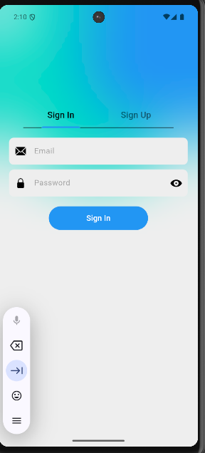
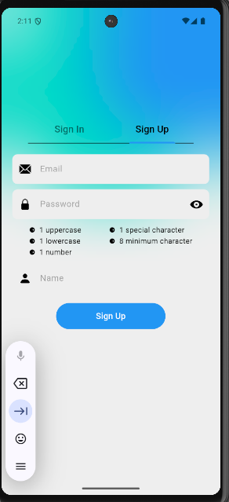
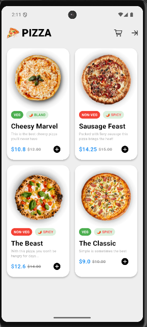
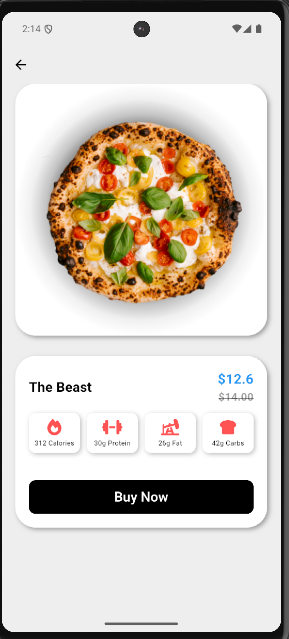
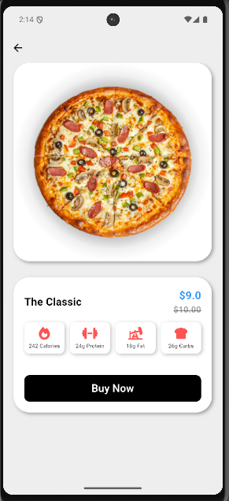

# 🍕 Pizza App 

A Flutter-based pizza ordering application

## Description

Pizza App is a Flutter project that provides a simple and efficient way to browse, customize, and order pizzas. It uses Firebase Firestore as backend for real-time data management and features state management using BLoC architecture

## Features
- Browse a variety of pizzas with appealing UI
- Custom pizza orders
- Real-time data synchronization with Firestore
- User authentication and management (via user_repository package)
- Clean state management with BLoC pattern

## 📸 Screenshots

### 👋 Sign In

  


### 🔐 Sign Up 


### 🏠 Home 
 

### 🍕 Detail
 


## 🚀 Getting Started

### Prerequisites
- Flutter SDK version >= 3.2.3 < 4.0.0
- Firebase account configured for Firestore
- Android Studio or VS Code recommended for development
- To run this app on your local machine:

#### 1. Clone the repository

```markdown
git clone https://github.com/your-username/flutter-pizza-app.git
```
#### 2. Navigate into the project directory

```markdown
cd pizza_app
```
#### 3. Get dependencies

```markdown
flutter pub get
```
#### 4. Run the app

```markdown
flutter run
```

## Dependencies

- flutter: Flutter SDK core
- cupertino_icons: iOS-style icons
- font_awesome_flutter: FontAwesome icons
- firebase_core: Firebase initialization
- cloud_firestore: Firebase Firestore database
- bloc and flutter_bloc: State management with BLoC pattern
- equatable: Simplifies equality comparisons in Dart objects
- user_repository: Custom user data handling package (local path)
- pizza_repository: Custom pizza data handling package (local path)

## License

[MIT](https://choosealicense.com/licenses/mit/)
